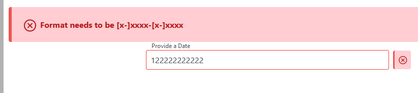
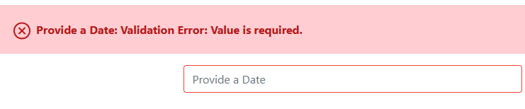
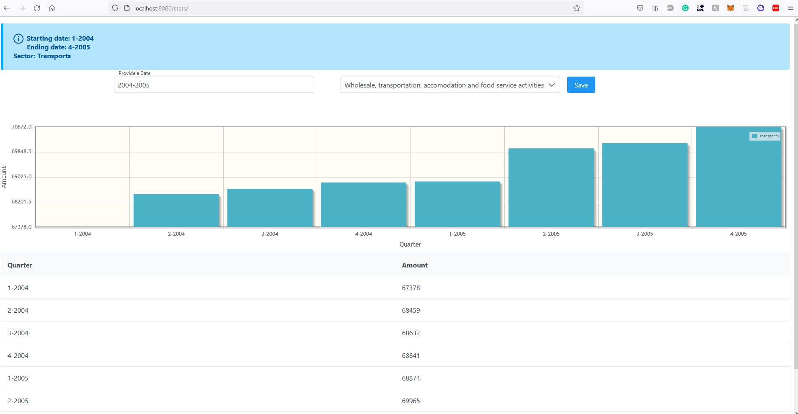
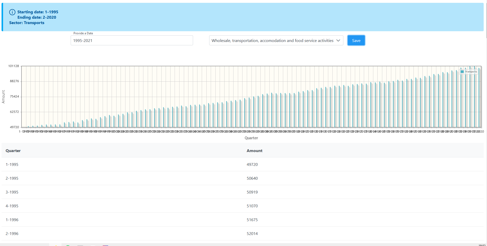

# :warning: Before reading this make sure to be in a proper editor that supports MD files. Otherwise pictures won't load properly.


# How to run

````
mvn clean
mvn compile
mvn wildfly:deploy
//open your webbrowser with http://localhost:8080/stats
````


# Added Dependency

Two dependency have been added to maven.

1. OpenCSV a simple library to parse CSV files.
2. PrimeFace which helped to implement the charts

# Useful commands to help you  test the program

# Highlight of some features

1. If nothing is entered in the secotr section either others or the previous selection will be taken again.

2. On a wrong date an error will pop up when hitting safe
   

3. From the screenshot above we can also see that there is a dynamic error symbol that will show up if the format isn't right and if someone hit's safe nothing will happen. 

4. If there has been no date entered an explicite error will show up.

   

# :warning:Things to avoid :warning:

* Having the window not in full screen. This is how it should look like in full-screen. Sadly I didn't managed to fit the CSS in a proper way to make work on all resolutions. My screen resolution is 1920x1080 but anything higher should also work.




* Taking a range that is too wide.



While it technically  works to have the minimum of 1995 to 2-2020 it's not recommanded to use it for readability purposes of the graph. The lables underneath will overlap and without overwritting some part of the API itself to show verticialy it couldn't have been done.
